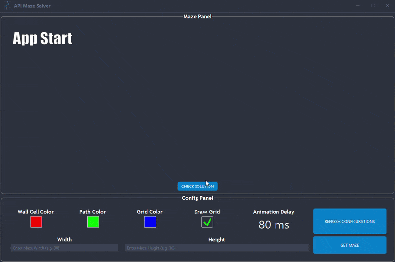
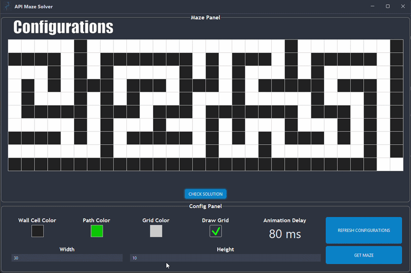
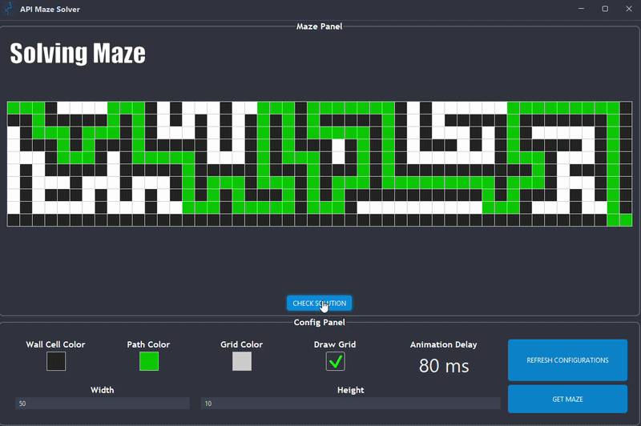

<a id="top"></a>


# API Maze Solver 🌐🧩

## 👋 Hello, World :D

### 🖼️ The Mission: From Image To Answer

The assignment was simple: build a desktop app that talks to a server, grabs a maze, figures out how to solve it from a plain picture, and animates it beautifully without crashing your computer.

Instead of typing out paths by hand, our app does the heavy lifting in a few neat steps:
*   **You Pick the Size:** Type in your target dimensions (try not to break it with 100 × 100, please).
*   **The App Asks the Server:** First, it makes an API call to ask *"Hey, what colors should I use today?"* Then it makes a second call to pull down a fresh, custom maze image as a `.png`.
*   **Pixel Detective Work:** The app scans the downloaded image pixel-by-pixel, using some clever math to translate colors into actual code coordinates (`Position` nodes).
*   **Swing Paints the Canvas:** It takes that data and instantly draws a clean, perfectly scaled maze layout on your screen.
*   **The Big Moment:** You click <sub></sub> . The pathfinder checks if you're trapped or not, and safely animates the winning route right before your eyes.

**Why this matters:** If we did all of this networking, image scanning, and pathfinding on the main screen thread, the app would freeze instantly and look like it died. By pushing the heavy work to background threads, the interface stays butter-smooth while the app does the math!

---
## 🚀 Application Features
*   **Anti-Spam Button Locks:** Temporarily disables buttons during API calls so users can’t rage-click and crash the network connection.
*   **Server-Driven Style Swaps:** Instantly applies custom color configs fetched fresh from the API (no hardcoded design disasters here).
*   **Foolproof Input Fields:** Bounded dimension checks (5 × 5 to 100 × 100) that gently correct typos before they break our code logic.

---
## ▶️ How To Start ?

### 🛠️ Setup Steps

1. **Get the Code:**
    * **Option A (The Developer Way):** Copy the repository URL from the green <sub></sub> button at the top right of this page, then clone it via your terminal: `git clone https://github.com/Sergey2334/API_Maze_Solver`
    * **Option B (The Quick Way):** Click the green <sub></sub> button at the top right of this page and select **Download ZIP**, then extract the files.

2. **Open the Project:**
    * Launch your favorite IDE ([IntelliJ IDEA](https://jetbrains.com), [Eclipse](https://eclipse.org), or [NetBeans](https://apache.org)).
    * Open or import the extracted project folder.

3. **Initialize the App:**
    * Navigate to the `Root` folder and run the `▶️ Main` class to pull up the environment interface.

---

## 🕹️ Running the Application

Before anything cool happens, you need to tell the app how big of a maze you want. Type your numbers into the `width` and `height` boxes at the bottom, and then unleash these primary buttons:

<sub></sub>
<sub></sub>

*Once clicked, the background threads wake up and do the heavy lifting while you sit back and enjoy the show.*

<details>
  <summary><h3 style="display: inline;">🎬 Proof That It Actually Works (App Demo inside)</h3></summary>

  <p align="center">
    <br><br>
    <br><br>
    
  </p>

</details>

### 🖥️ UI Layout & Controls

The interface keeps things simple by breaking the window into just two main layout panels, complete with a clean FlatLaf styling.

| Section | 🧩 The Maze Panel (Top / Center) | ⚙️ The Config Panel (Bottom)                                                                                      |
| :--- | :--- |:------------------------------------------------------------------------------------------------------------------|
| **Visuals & Feedback** | • High-res vector maze drawing canvas.<br>• Centered, adaptive square grid layout. | • Colored squares showing the server's fashion choices.<br>• Dynamic delay readout (how fast the pathfinder runs).|
| **Available Controls** | • **`CHECK SOLUTION`** button.<br>• Sequential, multi-phase path solver animations. | • **Width / Height** dimension text input fields.<br>• **`GET MAZE`** & **`REFRESH CONFIGURATIONS`** buttons.     |

---
## How It Works?

### 🎮 The Brains Behind the Operation (`MazeController`)

The `MazeController` is the ultimate control freak, it dictates exactly how our data models talk to the visual panels, coordinates our background workers, and leverages our underlying engine tools to get things done:

*   **The Payload Shopper (`ApiService`):** Instead of manually hardcoding design colors or downloading files through a browser, this service uses persistent connection pools to ask the server for layout settings and streams raw image bytes straight into memory:
    ```java
    // Fetch configuration properties directly from the server payload
    try (Response response = client.newCall(request).execute()) {
        JSONObject mazeConfigJson = new JSONObject(response.body().string());
        Color wallCellColor = Color.decode(mazeConfigJson.getString("wallCellColor"));
        boolean drawGrid = mazeConfigJson.getBoolean("drawGrid");
    }

    // Stream the incoming maze download raw bytes directly into the ImageIO parser engine
    try (InputStream inputStream = responseBody.byteStream()) {
        mazeImage = ImageIO.read(inputStream);
    }
    ```

*   **The Pixel-to-Code Translate Loop (`MazeDecoder`):** To avoid reading files from disk (which is slow and introduces bugs), this service scans the image in live system memory, jumps straight to the center of each cell grid, and extracts the precise RGB channels using bitwise shifts:
    ```java
    // Find the exact visual midpoint pixel of a target maze grid cell
    int pixelX = (int) ((x * cellWidthPixels) + (cellWidthPixels / 2.0));
    int pixelY = (int) ((y * cellHeightPixels) + (cellHeightPixels / 2.0));

    // Slice and dice the raw binary data stream into isolated color vectors
    int rgb = mazeImage.getRGB(pixelX, pixelY);
    int r = (rgb >> 16) & 0xFF; // Grab red channel vector
    int g = (rgb >> 8) & 0xFF;  // Grab green channel vector
    int b = rgb & 0xFF;         // Grab blue channel vector

    // Since the server paths are always bright white, everything else is treated as a solid wall!
    boolean isPath = (r > 200 && g > 200 && b > 200);
    boolean isWall = !isPath;
    ```

*   **The Route Animator (`MazeAnimator`):** Uses precise Swing timers to smoothly draw the winning route step-by-step so you don't get lost watching it!

---
## Project Structure & Architecture
### 🏗️ How it's Built: The MVC Breakdown

This project follows the classic **MVC (Model-View-Controller) pattern** to keep things tidy, easy to update, and isolated so that a visual bug won’t crash our backend data:

*   **Model (`Maze`):** The absolute brains of the operation. It knows nothing about buttons or screens; it just tracks the grid matrix, wall states, and coordinate flags in pure numbers.
*   **View (`MainWindow` & Swing Panels):** The pretty face of the app. It handles our custom `paintComponent` drawing loops, responsive alignments, and FlatLaf themes, strictly waiting for data to display.
*   **Controller (`MazeController`):** The stressed middleman. It catches your button clicks, forces the input fields to play nice, commands the `ApiService` to download files, and feeds the results back to the View.

### 📁 Project Architecture
<details>
  <summary>📂 <b>Main</b></summary>
  <br>
  <ul>
    <li>📂 <b>src/main/java</b>
      <ul>
        <li>📂 <b>Root</b>
          <ul>
            <!-- CONTROLLER -->
            <li>
              <details>
                <summary>📂 <b>controller</b></summary>
                <ul>
                  <li>📄 MazeController.java</li>
                </ul>
              </details>
            </li>
            <!-- CORE -->
            <li>
              <details>
                <summary>📂 <b>core</b></summary>
                <ul>
                  <li>📄 Constants.java</li>
                  <li>📄 MyUtils.java</li>
                </ul>
              </details>
            </li>
            <!-- MODEL -->
            <li>
              <details>
                <summary>📂 <b>model</b></summary>
                <ul>
                  <li>📄 Maze.java</li>
                  <li>📄 MazeConfig.java</li>
                  <li>📄 Position.java</li>
                </ul>
              </details>
            </li>
            <!-- SERVICE -->
            <li>
              <details>
                <summary>📂 <b>service</b></summary>
                <ul>
                  <li>📄 ApiService.java</li>
                  <li>📄 MazeAnimator.java</li>
                  <li>📄 MazeDecoder.java</li>
                  <li>📄 MazeSolver.java</li>
                </ul>
              </details>
            </li>
            <!-- VIEW -->
            <li>
              <details>
                <summary>📂 <b>view</b></summary>
                <ul>
                  <li>
                    <details>
                      <summary>📂 <b>MainWindow</b></summary>
                      <ul>
                        <li>📄 MainWindow.java</li>
                      </ul>
                    </details>
                  </li>
                  <li>
                    <details>
                      <summary>📂 <b>MazePanel</b></summary>
                      <ul>
                        <li>📄 MazePanel.java</li>
                      </ul>
                    </details>
                  </li>
                  <li>
                    <details>
                      <summary>📂 <b>ConfigPanel</b></summary>
                      <ul>
                        <li>📄 ConfigPanel.java</li>
                      </ul>
                    </details>
                  </li>
                  <li>
                    <details>
                      <summary>📂 <b>ViewUtils</b></summary>
                      <ul>
                        <li>📄 MyButton.java</li>
                        <li>📄 ViewUtils.java</li>
                      </ul>
                    </details>
                  </li>
                </ul>
              </details>
            </li>
          </ul>
        </li>
      </ul>
    </li>
    <br>
    <li><code>Main.java</code> <kbd>⬅️ Start Here :D</kbd></li>
  </ul>
</details>

---
## 👋 Goodbye World :D

Building this project taught us about fetching live server parameters over the web and slicing up raw image bytes directly in system memory. It turns out that teaching a computer to "look" at a picture and build an interactive grid out of it is a fantastic way to understand how backend APIs and graphics talk to each other.

**We hope you enjoy testing out different maze sizes! If our background pipelines hold up, your app should stay smooth and responsive. (Key word: *Should*... 🙃)**

---
<div align="right">

[Back To Top ⬆️](#top)

</div>